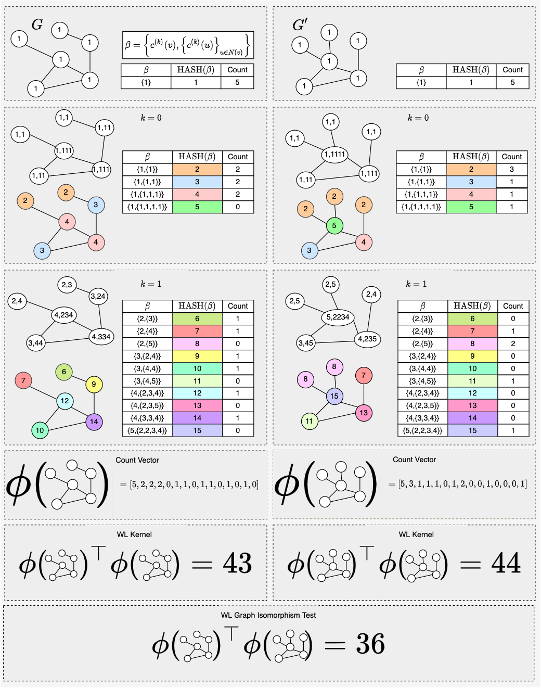

### Graph Kernels

- Graph kernels $\phi({G})$, are used to compute the similarity between two graphs.

### Weisfeiler-Lehman(WL) Kernel [^1]

[^1]: [Stanford CS224W Lecture 2.3](https://www.youtube.com/watch?v=buzsHTa4Hgs)

> **Color Refinement Algorithm**:
>
> - Given a graph $G$ with a set of nodes $V$
>     - Assign an initial color $c^{(0)}(v)$ to each node $v$
>     - Iteratively refine node colors by
>       - $C^{(k+1)}(v)=\operatorname{HASH}\left(\left\{c^{(k)}(v),\left\{c^{(k)}(u)\right\}_{u \in N(v)}\right\}\right)$
>
> - $\operatorname{HASH}$ maps different inputs to different **colors**

After $K$ steps of color refinement, $c^{K}(v)$ summarizes the structure of the $K$-hope neighborhood.

The WL kernel $\phi$ counts the number of nodes of a given color. The kernel represents a graph with a bag of colors. In more detail the kernel uses a generalized version of "bag of node degrees" since the node degrees are one-hop neighborhood information.

The WL kernel provides a strong benchmark for the development of GNNs since it is both computationally efficient and expressive. The cost to compute the WL kernel is linear in the number of edges since at each step information is aggregated at each node from its neighbors. Counting colors is linear w.r.t. the number of nodes, but since there are typically an order magnitude or more edges than nodes in real world graphs, the WL kernel time complexity is linear in the number of edges. Since we are discussing a kernel this is number of edges in both graphs.

### WL Graph Isomorphism Test

<!-- CHECK -->
The WL Graph Isomorphism Test (WL test) only guarantees that two are graphs not isomorophic if $\phi{(G)}^{\top}\phi{(G)} \neq \phi{(G)}^{\top}\phi{(G^{\prime})}$, at any stage during color refinement. In general the WL test can give a measure of similarity or closeness to isomorphism between two graphs.

### WL Test Toy Example

As we can see in the example different colors capture different $k$-hop neighborhood structure. In this case $\phi({G})^{\top}\phi({G^{\prime}})=36$. We know from $\phi({G})^{\top}\phi({G})$ and $\phi({G^{\prime}})^{\top}\phi({G^{\prime}})$, that the two graphs are not isomorphic.

In fact we could have seen that these graphs were different after the first stage of color refinement

<!-- TODO fix this since the definition of the test is at any point discontinue -->

"Our key insight is that a GNN can have as large discriminative power as the WL test if the GNN’s aggregation scheme is highly expressive and can model injective functions."

