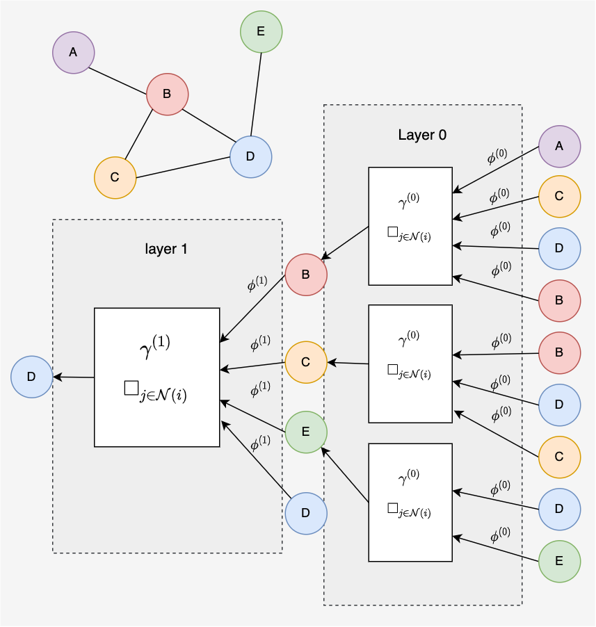

## Message Passing Framework
$$
\mathbf{x}_i^{(k)}=\gamma^{(k)}\left(\mathbf{x}_i^{(k-1)}, \square_{j \in \mathcal{N}(i)} \phi^{(k)}\left(\mathbf{x}_i^{(k-1)}, \mathbf{x}_j^{(k-1)}, \mathbf{e}_{j, i}\right)\right)
$$

$\square_{j \in \mathcal{N}(i)}$ - Differentiable, permutation invariant function, *e.g.* sum, mean, or max.

$\phi^{(k)}$ - Differentiable functions such as Multi-Layer Perceptrons (MLPs)

$\gamma^{(k)}$ - Differentiable functions such MLPs

### Toy Example

To gain some intuition of a message passing framework we will take a small graph as example.

We will consider messages passed to node $D$ in a 2-layer message passing neural network. The computational graph can be traced out from node $D$ first to a 1-hop neighborhood and then to a 2-hop neighborhood. The 1-hop neighborhood contains all nodes except node $A$. Including node $D$ is often considered optional and is can be interpreted as adding self-loops to the graph. Layer 0 looks shows connections from the 2-hop neighborhood of node $D$.

